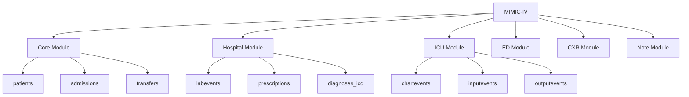

# MIMIC Schema Overview
{: .no_toc }

## Table of contents
{: .no_toc .text-delta }

1. TOC
{:toc}

---

Understanding the overall structure and organization of the MIMIC database is crucial for effective analysis.

## Modular Design

MIMIC-IV uses a modular design where data is organized by **provenance** - the source or origin of the data. This design reflects the reality of hospital data systems.



## Core Identifier System

The database uses a hierarchical identifier system:

### Patient Level


### Hospital Admission Level  


### Unit Stay Level


## Data Flow Through the Hospital

Understanding how patients move through the hospital helps understand the data:

1. **Patient arrives** → `subject_id` assigned
2. **Hospital admission** → `hadm_id` assigned  
3. **Unit transfer** → `stay_id` assigned (ICU, ED, etc.)
4. **Data collection** → Events recorded with appropriate IDs

## Module Characteristics

### Core Module
- **Purpose**: Basic patient and admission tracking
- **Key Tables**: `patients`, `admissions`, `transfers`
- **Coverage**: All patients
- **Granularity**: Admission-level

### Hospital (Hosp) Module
- **Purpose**: Hospital-wide EHR data
- **Key Tables**: `labevents`, `prescriptions`, `diagnoses_icd`
- **Coverage**: All hospital patients
- **Granularity**: Order/event-level

### ICU Module
- **Purpose**: Intensive care monitoring
- **Key Tables**: `chartevents`, `inputevents`, `outputevents`
- **Coverage**: ICU patients only
- **Granularity**: Hour-to-hour or more frequent

### Emergency Department (ED) Module
- **Purpose**: Emergency department care
- **Key Tables**: `edstays`, `triage`, `vitalsign`
- **Coverage**: ED patients only
- **Granularity**: Visit-level and event-level

## Data Relationships

### One-to-Many Relationships
- One patient → Many admissions
- One admission → Many diagnoses  
- One admission → Many lab results
- One ICU stay → Many vital sign measurements

### Cross-Module Linking
Patients can be followed across modules using identifiers:

```sql
-- Link patient demographics to ICU data
SELECT p.gender, c.valuenum as heart_rate
FROM mimic_core.patients p
JOIN mimic_hosp.admissions a ON p.subject_id = a.subject_id
JOIN mimic_icu.icustays i ON a.hadm_id = i.hadm_id  
JOIN mimic_icu.chartevents c ON i.stay_id = c.stay_id
WHERE c.itemid = 220045  -- Heart rate
```

## Temporal Considerations

### Time Zones
- All times in the database are **hospital local time**
- No daylight saving time adjustments
- Consistent across all modules

### Time Precision
- **Core/Hosp**: Usually day or hour precision
- **ICU**: Minute-level precision common
- **ED**: Varies by event type

## Data Quality Characteristics

### Completeness
- **Core data**: Nearly 100% complete
- **Hospital data**: Good completion for most elements
- **ICU data**: Varies by measurement type
- **Clinical notes**: Available for subset of patients

### Consistency
- Identifier linkage is reliable
- Time stamps are consistent within modules
- Some variation in documentation practices over time

## Common Analysis Patterns

### Patient Cohort Selection
1. Start with `patients` table for demographics
2. Join to `admissions` for admission criteria
3. Add module-specific criteria as needed

### Longitudinal Analysis
1. Identify patient population
2. Extract events from relevant modules
3. Align timestamps for temporal analysis

### Outcome Assessment
1. Define outcome from appropriate module
2. Link back to patient characteristics
3. Account for censoring and follow-up

## Best Practices

### Query Design
- Always include appropriate time filters
- Be mindful of data volume in ICU module
- Use indexed columns for joins when possible

### Data Validation
- Check for reasonable value ranges
- Validate identifier linkages
- Account for missing data patterns

### Documentation
- Document data inclusion/exclusion criteria
- Note any module-specific limitations
- Record analysis time periods

---

{: .note }
> This schema overview provides the foundation for understanding MIMIC data. Each module has its own detailed documentation with table-specific information.
